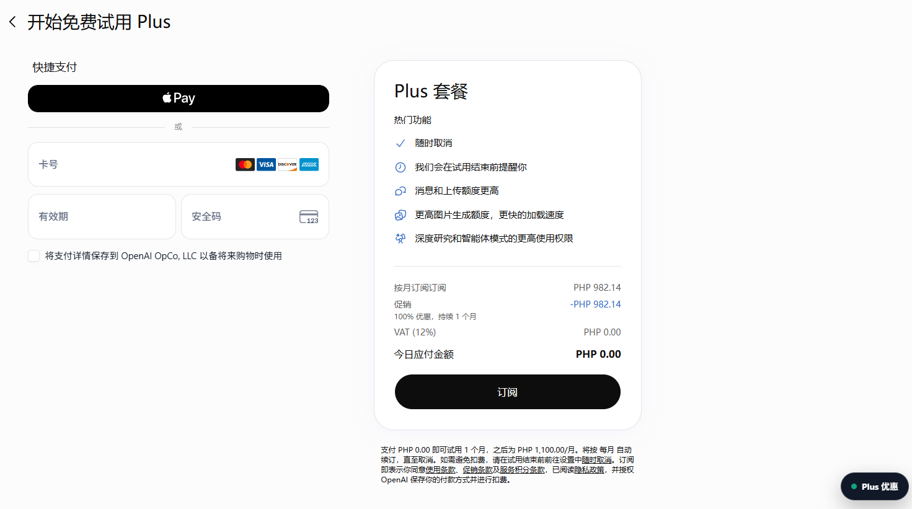

# Plus Extractor

<p align="center">
  <a href="https://github.com/shi-YangYang/plus-extractor"></a>
  
  
  
  
  <br>
  
  
  <a href="LICENSE"></a>
</p>

一键提取plus优惠

已支持渠道：【菲律宾】

Plus Extractor 是一个仅在本地浏览器中运行的 Chrome/Edge Manifest V3 扩展。它把原始书签脚本封装成带登录检测、参数确认、错误反馈和重复提交保护的页面 UI，帮助符合资格的用户更清晰地进入 ChatGPT Plus 官方结账流程。

扩展源码位于 `chatgpt-checkout-helper` 子目录。项目不隶属于 OpenAI，也不保证任何促销资格或优惠结果。

US和UR代理在：`https://www.kookeey.com`，注册免费送2G流量，非广、非广、非广！！

## 目录

- [安全](#安全)
- [背景](#背景)
- [安装](#安装)
- [使用](#使用)
- [截图](#截图)
- [常见问题](#常见问题)
- [开发与验证](#开发与验证)
- [项目结构](#项目结构)
- [维护者](#维护者)
- [参与贡献](#参与贡献)
- [许可证](#许可证)

## 安全

本项目会在用户主动确认后调用 ChatGPT 网页使用的结账接口。使用前请了解以下边界：

- 仅在账单地区信息真实、本人明确符合活动资格时使用。
- 活动资格、优惠金额、税费和续费规则以官方结账页显示为准。
- 如果结账页未显示预期优惠，请勿继续付款。
- 项目调用的是未公开的网页内部接口，不属于 OpenAI 公共 API，可能随时变化或失效。
- 扩展不会把 access token 写入本地存储、控制台或第三方服务器；令牌只在单次请求链路的内存中短暂使用。
- 扩展只注入 `https://chatgpt.com/*`，不申请 `<all_urls>` 或 Cookie 权限。
- 请自行审查源码，不要安装来源不明或经过二次修改的构建。

当前结账参数沿用原始脚本：

| 参数 | 值 |
| --- | --- |
| 计划 | `chatgptplusplan` |
| 账单地区 | `PH` |
| 币种 | `PHP` |
| 活动 | `plus-1-month-free` |

## 背景

项目最初来自一段需要手动保存和运行的 JavaScript 书签代码。书签脚本虽然简短，但缺少参数展示、状态反馈、超时处理以及防重复执行机制，也不便于持续维护。

Plus Extractor 使用浏览器内容脚本在 ChatGPT 页面内提供隔离 UI。扩展不会建立本地服务器，也不要求用户复制登录凭证，从而减少了跨域配置和敏感信息暴露面。

运行时没有第三方依赖；只有执行本地测试时需要 Node.js。

## 安装

### 新电脑首次安装需要什么

仅在浏览器中加载扩展目录还不够。已经验证通过的两阶段代理链路还需要：

- Chrome 或 Edge；
- Node.js 18 或更高版本，用于运行本地中继；
- Clash Verge、Mihomo 或兼容客户端；
- 本机 HTTP 代理监听地址为 `127.0.0.1:7897`；
- Windows 首次运行一次 `relay/install-relay.ps1`；
- macOS 首次运行一次 `relay/install-relay.sh`。

网络链路如下：

```text
浏览器 → 本地中继 127.0.0.1:17897 → Mihomo/Clash 127.0.0.1:7897
       → 代理供应商网关 → ChatGPT
```

完成首次配置后，本地中继会随 Windows 登录或 macOS 用户登录自动启动。日常使用时只需启动 Mihomo/Clash、打开浏览器并操作扩展。

### 1. 获取扩展文件

通过以下任一方式获取扩展。

#### 方法一：克隆项目

使用 Git 克隆仓库：

```shell
git clone https://github.com/shi-YangYang/plus-extractor.git
cd plus-extractor
```

扩展目录为：

```text
plus-extractor/chatgpt-checkout-helper
```

#### 方法二：下载 ZIP

1. 下载 `chatgpt-checkout-helper.zip`。
2. 将 ZIP 完整解压到固定目录。
3. 确认解压目录根部包含 `manifest.json`、`background.js`、`content.js` 和 `relay` 目录。

### 2. 安装本机运行环境

#### 安装 Node.js

安装 Node.js 18 或更高版本，然后在 Windows PowerShell 或 macOS Terminal 中确认：

```shell
node --version
```

#### 配置 Mihomo/Clash

1. 安装并启动 Clash Verge、Mihomo 或兼容客户端；
2. 开启系统代理或保证其本地 HTTP 代理处于运行状态；
3. 确认 HTTP 监听地址为 `127.0.0.1:7897`。

如果客户端使用其他端口，请先将其 HTTP 端口调整为 `7897`，再安装本地中继。

### 3. 安装本地中继（区分操作系统）

#### Windows

在包含 `manifest.json` 的扩展目录打开 PowerShell，然后执行：

```powershell
powershell.exe -NoProfile -ExecutionPolicy Bypass -File .\relay\install-relay.ps1
```

成功时会显示以下任一结果：

```text
RELAY_STARTED
RELAY_ALREADY_RUNNING
```

本地中继地址为：

```text
代理端口：127.0.0.1:17897
控制端口：127.0.0.1:17898
```

可以使用以下命令检查中继状态：

```powershell
Invoke-RestMethod http://127.0.0.1:17898/status
```

返回结果中的 `ready` 应为 `true`。

#### macOS

macOS 可以额外安装 PowerShell 7，但本项目的 Windows `.ps1` 脚本使用了 Windows 启动目录、VBS 和窗口参数。macOS 请使用项目提供的 Bash 脚本和 `launchd`。

在包含 `manifest.json` 的扩展目录打开 Terminal，然后执行：

```bash
bash ./relay/install-relay.sh
```

脚本会创建并加载：

```text
~/Library/LaunchAgents/com.plus-extractor.relay.plist
```

成功时同样会显示 `RELAY_STARTED` 或 `RELAY_ALREADY_RUNNING`。检查状态：

```bash
curl -fsS http://127.0.0.1:17898/status
```

返回 JSON 中的 `ready` 应为 `true`。日志位置：

```text
~/Library/Logs/PlusExtractorRelay/relay.log
~/Library/Logs/PlusExtractorRelay/relay-error.log
```

### 4. 加载到 Chrome

1. 打开以下地址：

   ```text
   chrome://extensions/
   ```

2. 开启右上角的“开发者模式”。
3. 点击“加载已解压的扩展程序”。
4. 选择包含 `manifest.json` 的扩展目录。

### 5. 加载到 Edge

1. 打开以下地址：

   ```text
   edge://extensions/
   ```

2. 开启“开发人员模式”。
3. 点击“加载解压缩的扩展”。
4. 选择包含 `manifest.json` 的扩展目录。

### 6. 首次运行检查

1. 登录并打开 `https://chatgpt.com/`；
2. 刷新页面，确认右下角出现 Plus 结账入口；
3. 打开面板并填入 US、TR 两组代理；
4. 如需让整个浏览器的普通窗口手动启用 US 代理，点击“整个浏览器使用 US 代理”；插件会从代理池 1 轮换选取，并由扩展后台检测切换前后出口 IP 和地区（不刷新页面）；
5. 执行流程前确认 Mihomo/Clash 和本地中继均处于运行状态。

### 更新扩展

如果通过 Git 安装，拉取最新代码：

```shell
git pull
```

如果通过 Release 安装，下载新版本压缩包并替换原扩展目录。

更新文件后：

1. Windows 再次运行 `relay/install-relay.ps1`，macOS 再次运行 `bash ./relay/install-relay.sh`；
2. 在扩展管理页面点击“重新加载”；
3. 刷新 ChatGPT 页面。

### 停止或卸载本地中继

#### Windows

停止当前中继：

```powershell
powershell.exe -NoProfile -ExecutionPolicy Bypass -File .\relay\stop-relay.ps1
```

移除自动启动项并停止中继：

```powershell
powershell.exe -NoProfile -ExecutionPolicy Bypass -File .\relay\uninstall-relay.ps1
```

#### macOS

停止当前中继：

```bash
bash ./relay/stop-relay.sh
```

移除 `launchd` 自动启动项并停止中继：

```bash
bash ./relay/uninstall-relay.sh
```

## 使用

常规流程：

```text
登录 ChatGPT → 打开 Plus 结账面板 → 确认参数与资格 → 创建会话 → 核对官方结账页
```

1. 登录并打开 [ChatGPT](https://chatgpt.com/)。
2. 刷新页面，确认右下角出现“Plus 结账”按钮。
3. 点击按钮，等待扩展检测当前登录状态。
4. 核对计划、账单地区、币种和活动参数。
5. 阅读提示并勾选确认框。
6. 点击“创建结账会话”。
7. 跳转后再次核对最终价格、优惠期和续费规则，再决定是否付款。

## 截图

### 页面入口


### 结账确认面板


### 最终优惠


## 常见问题

**页面没有出现按钮**

确认扩展已启用、当前地址属于 `https://chatgpt.com/`，然后重新加载扩展并刷新页面。

**提示未检测到登录凭证**

确认当前页面已经登录正确的 ChatGPT 账号，然后刷新页面重试。

**提示 HTTP 错误或请求失败**

可能是内部接口已经调整、当前账号不符合资格或网络请求失败。不要连续重复提交；请稍后检查结账入口或使用官方活动链接。

**成功跳转但没有显示优惠**

不要付款。活动字段只是请求参数，最终资格和价格由服务端决定。

## 开发与验证

扩展没有构建步骤，修改源码后可直接在扩展管理页面重新加载。

需要 Node.js 18 或更高版本运行检查：

```shell
cd chatgpt-checkout-helper
node --check core.js
node --check content.js
node --test tests\*.test.cjs
```

当前测试基线为 41 项。

测试覆盖请求体构造、结账地址编码、响应解析和错误信息格式化。实际支付接口不会在自动测试中调用。

## 项目结构

```text
plus-extractor/
├── chatgpt-checkout-helper/
│   ├── tests/
│   │   └── core.test.cjs
│   ├── core.js
│   ├── content.js
│   ├── manifest.json
│   └── README.md
├── docs/
│   └── images/
│       ├── 1.png
│       └── 2.png
├── LICENSE
└── README.md
```

- `manifest.json`：Manifest V3 扩展声明与注入范围。
- `core.js`：请求参数、响应解析和可测试的纯函数。
- `content.js`：页面 UI、登录检测和结账请求流程。
- `tests/core.test.cjs`：Node.js 内置测试运行器用例。

## 维护者

[@shi-YangYang](https://github.com/shi-YangYang)

## 参与贡献

欢迎提交问题和改进建议：

- 使用 [GitHub Issues](https://github.com/shi-YangYang/plus-extractor/issues) 报告问题或提出功能建议。
- 接受 Pull Request；请保持改动范围清晰，并在提交前运行现有检查和测试。
- 不要在 Issue、日志、截图或测试夹具中提交 access token、结账会话 ID 或其他账号信息。

## 许可证

[MIT](LICENSE) © 2026 shi-YangYang
