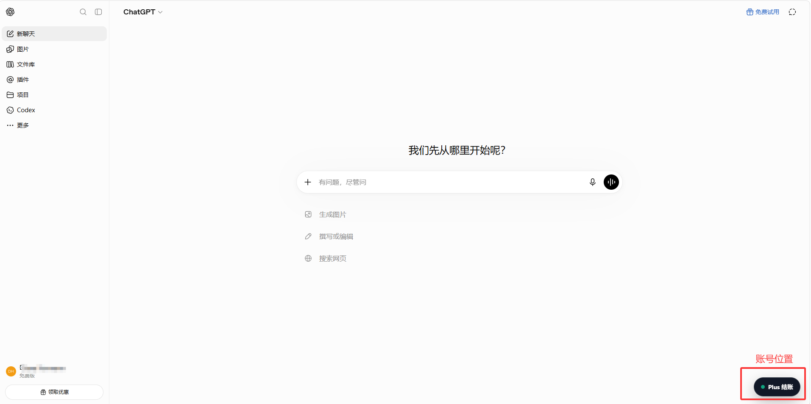
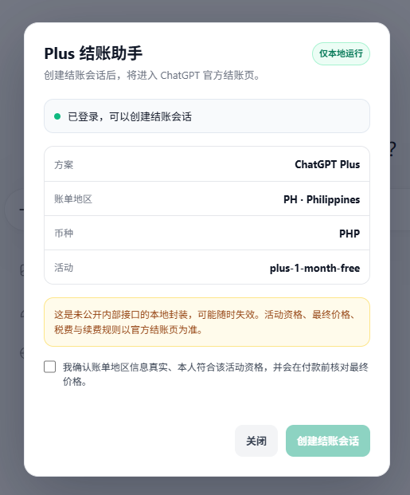

# Plus Extractor

[](https://github.com/RichardLitt/standard-readme)

一键提取plus优惠

已支持渠道：【菲律宾】

Plus Extractor 是一个仅在本地浏览器中运行的 Chrome/Edge Manifest V3 扩展。它把原始书签脚本封装成带登录检测、参数确认、错误反馈和重复提交保护的页面 UI，帮助符合资格的用户更清晰地进入 ChatGPT Plus 官方结账流程。

扩展源码位于 `chatgpt-checkout-helper` 子目录。项目不隶属于 OpenAI，也不保证任何促销资格或优惠结果。

## 目录

- [安全](#安全)
- [背景](#背景)
- [安装](#安装)
- [使用](#使用)
- [截图](#截图)
- [常见问题](#常见问题)
- [开发与验证](#开发与验证)
- [项目结构](#项目结构)
- [维护者](#维护者)
- [参与贡献](#参与贡献)
- [许可证](#许可证)

## 安全

本项目会在用户主动确认后调用 ChatGPT 网页使用的结账接口。使用前请了解以下边界：

- 仅在账单地区信息真实、本人明确符合活动资格时使用。
- 活动资格、优惠金额、税费和续费规则以官方结账页显示为准。
- 如果结账页未显示预期优惠，请勿继续付款。
- 项目调用的是未公开的网页内部接口，不属于 OpenAI 公共 API，可能随时变化或失效。
- 扩展不会把 access token 写入本地存储、控制台或第三方服务器；令牌只在单次请求链路的内存中短暂使用。
- 扩展只注入 `https://chatgpt.com/*`，不申请 `<all_urls>` 或 Cookie 权限。
- 请自行审查源码，不要安装来源不明或经过二次修改的构建。

当前结账参数沿用原始脚本：

| 参数 | 值 |
| --- | --- |
| 计划 | `chatgptplusplan` |
| 账单地区 | `PH` |
| 币种 | `PHP` |
| 活动 | `plus-1-month-free` |

## 背景

项目最初来自一段需要手动保存和运行的 JavaScript 书签代码。书签脚本虽然简短，但缺少参数展示、状态反馈、超时处理以及防重复执行机制，也不便于持续维护。

Plus Extractor 使用浏览器内容脚本在 ChatGPT 页面内提供隔离 UI。扩展不会建立本地服务器，也不要求用户复制登录凭证，从而减少了跨域配置和敏感信息暴露面。

运行时没有第三方依赖；只有执行本地测试时需要 Node.js。

## 安装

先通过以下任一方式获取扩展文件。

### 方法一：克隆项目

使用 Git 克隆仓库：

```shell
git clone https://github.com/shi-YangYang/plus-extractor.git
cd plus-extractor
```

扩展目录为：

```text
plus-extractor/chatgpt-checkout-helper
```

### 方法二：下载 Release 压缩包

1. 打开项目的 [Releases 页面](https://github.com/shi-YangYang/plus-extractor/releases)。
2. 选择所需版本，下载对应的扩展压缩包。
3. 将压缩包完整解压到一个固定目录；浏览器不能直接加载 ZIP 文件。
4. 找到解压后包含 `manifest.json` 的目录，后续加载该目录。

### 加载到 Chrome

1. 打开以下地址：

   ```text
   chrome://extensions/
   ```

2. 开启右上角的“开发者模式”。
3. 点击“加载已解压的扩展程序”。
4. 选择包含 `manifest.json` 的扩展目录。

### 加载到 Edge

1. 打开以下地址：

   ```text
   edge://extensions/
   ```

2. 开启“开发人员模式”。
3. 点击“加载解压缩的扩展”。
4. 选择包含 `manifest.json` 的扩展目录。

### 更新

如果通过 Git 安装，拉取最新代码：

```shell
git pull
```

如果通过 Release 安装，下载新版本压缩包并替换原扩展目录。

更新文件后，在扩展管理页面点击该扩展的“重新加载”按钮，再刷新 ChatGPT 页面。

## 使用

常规流程：

```text
登录 ChatGPT → 打开 Plus 结账面板 → 确认参数与资格 → 创建会话 → 核对官方结账页
```

1. 登录并打开 [ChatGPT](https://chatgpt.com/)。
2. 刷新页面，确认右下角出现“Plus 结账”按钮。
3. 点击按钮，等待扩展检测当前登录状态。
4. 核对计划、账单地区、币种和活动参数。
5. 阅读提示并勾选确认框。
6. 点击“创建结账会话”。
7. 跳转后再次核对最终价格、优惠期和续费规则，再决定是否付款。

## 截图

### 页面入口



### 结账确认面板



## 常见问题

**页面没有出现按钮**

确认扩展已启用、当前地址属于 `https://chatgpt.com/`，然后重新加载扩展并刷新页面。

**提示未检测到登录凭证**

确认当前页面已经登录正确的 ChatGPT 账号，然后刷新页面重试。

**提示 HTTP 错误或请求失败**

可能是内部接口已经调整、当前账号不符合资格或网络请求失败。不要连续重复提交；请稍后检查结账入口或使用官方活动链接。

**成功跳转但没有显示优惠**

不要付款。活动字段只是请求参数，最终资格和价格由服务端决定。

## 开发与验证

扩展没有构建步骤，修改源码后可直接在扩展管理页面重新加载。

需要 Node.js 18 或更高版本运行检查：

```shell
cd chatgpt-checkout-helper
node --check core.js
node --check content.js
node --test tests/core.test.cjs
```

测试覆盖请求体构造、结账地址编码、响应解析和错误信息格式化。实际支付接口不会在自动测试中调用。

## 项目结构

```text
plus-extractor/
├── chatgpt-checkout-helper/
│   ├── tests/
│   │   └── core.test.cjs
│   ├── core.js
│   ├── content.js
│   ├── manifest.json
│   └── README.md
├── docs/
│   └── images/
│       ├── 1.png
│       └── 2.png
├── LICENSE
└── README.md
```

- `manifest.json`：Manifest V3 扩展声明与注入范围。
- `core.js`：请求参数、响应解析和可测试的纯函数。
- `content.js`：页面 UI、登录检测和结账请求流程。
- `tests/core.test.cjs`：Node.js 内置测试运行器用例。

## 维护者

[@shi-YangYang](https://github.com/shi-YangYang)

## 参与贡献

欢迎提交问题和改进建议：

- 使用 [GitHub Issues](https://github.com/shi-YangYang/plus-extractor/issues) 报告问题或提出功能建议。
- 接受 Pull Request；请保持改动范围清晰，并在提交前运行现有检查和测试。
- 不要在 Issue、日志、截图或测试夹具中提交 access token、结账会话 ID 或其他账号信息。

## 许可证

[MIT](LICENSE) © 2026 shi-YangYang
